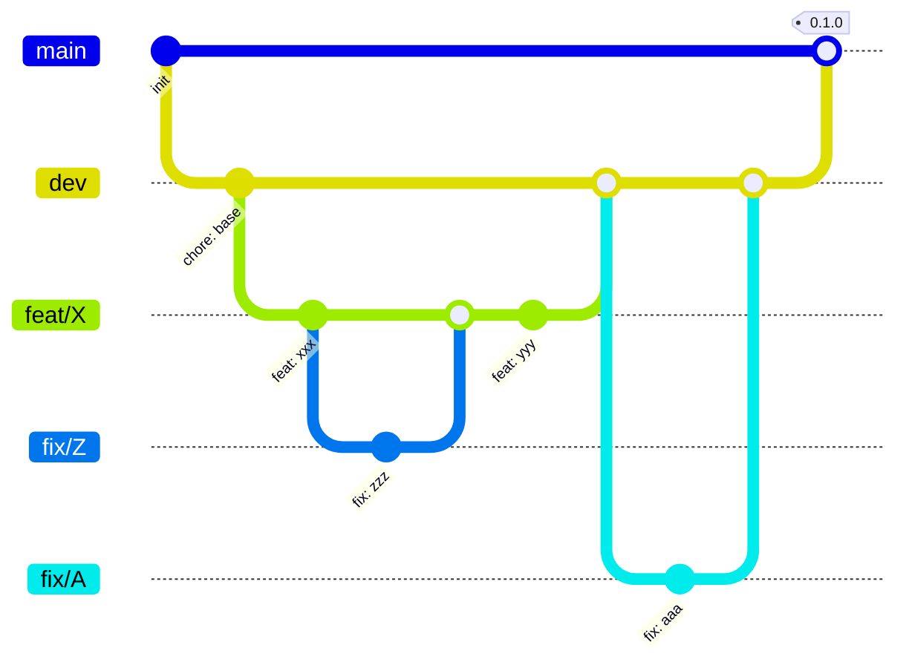

# Contributing to Mneme

## Getting Started

```bash
git clone git@github.com:YUcxovo/MNEME.git
cd MNEME
./tools/setup.sh
git lfs install   # verify LFS is set up
```

Prerequisites: Python 3.11+, JDK 17, uv, Git, Git LFS

## File Structure

```
MNEME/
|-- .github/                  # GitHub config (CI workflows, templates, CODEOWNERS)
|-- tools/                    # Team-wide dev scripts (setup, check, deploy)
|-- android/                  # Android client (Kotlin + Jetpack Compose)
|-- backend/                  # Python backend (FastAPI + PostgreSQL + RAG)
|-- deploy/                   # Provider-neutral production templates and runbook
|-- docs/                     # Project documentation (ADR, API, meeting notes, thesis)
|-- .gitignore                # Whitelist-based ignore rules
|-- .gitattributes            # LFS tracking + LF line ending normalization
|-- lefthook.yml              # Git hooks configuration
|-- commitlint.config.mjs         # Commitlint rules
|-- CONTRIBUTING.md           # This file
|-- CHANGELOG.md              # Human-readable change log
|-- LICENSE                   # MIT License
`-- README.md                 # Project overview
```

## Branch Strategy



- `main`: production-ready, every commit is a demo-able state
- `dev`: integration branch, feature PRs land here first
- `feat/<desc>`, `fix/<desc>`, `refactor/<desc>`, `chore/<desc>`, `docs`, `ci`: work branches
- A `fix/*` branch may branch from a `feat/*` if the bug is specific to that feature and the feature is still in progress. Merge it back into `feat/*` *before* the feature merges into `dev`. Fixes unrelated to any in-progress feature branch from `dev` as usual.

> **Note:** The mermaid diagram uses `merge` for visual simplicity. In practice, all branch integration uses **rebase-ff**, so the real commit history is a single linear line with no merge bubbles.

Never commit directly to `main` or `dev`. Always rebase, never merge.

## CHANGELOG

This project follows [Keep a Changelog](https://keepachangelog.com/en/1.1.0/) format in `CHANGELOG.md`.

Each release documents changes under these headings:

- **Added**: new features
- **Changed**: changes in existing functionality
- **Deprecated**: soon-to-be-removed features
- **Removed**: now removed features
- **Fixed**: bug fixes
- **Security**: vulnerability fixes

When your PR introduces a user-facing change, add a one-line entry under the `[Unreleased]` section in `CHANGELOG.md`.

Release tags follow [Semantic Versioning](https://semver.org/): `<MAJOR>.<MINOR>.<PATCH>`.

## Commit Conventions

Follow [Conventional Commits](https://www.conventionalcommits.org/):

```
<type>(<scope>): <description>

Allowed types: feat, fix, refactor, docs, test, chore, ci, perf, style, build, revert
Scope is optional, e.g. (backend), (android), (ai)
```

Rules:
- Commit messages must be ASCII-only
- Keep commits atomic, single logical change per commit
- pre-commit hook will prompt if a commit touches >=250 lines in `.py`/`.kt` files (config/docs/config files excluded to avoid false positives)


## Issue Templates

Open an issue from 5 templates:

- **[FIX]** for Bug Fix
- **[FEAT]** for Feature Development
- **[PERF]** for Performance
- **[DOCS]** for Documentation
- **[CI]** for Repo maintenance or Tooling

Each time choose labels, assignees, milestone, relationships and development for a new issue.

Comment when making process on an issue. Move to fallback plan if one cannot be finished on time.

Blank issues are disabled.

## Pull Request Process

1. Create a feature branch from `dev`
2. Make your changes, commit following conventions
3. Push to corresponding branch. Hooks run pre-push checks; CI runs on push
4. Open a PR to `dev` with PR template
5. Choose assignees, labels, milestone and development
6. Must make meaningful reviews and comments as reviewer
7. At least 1 approval required for `dev`, 4 approvals for `main`
8. CI must pass
9. Update Trello after changing status
10. Close corresponding issue (should be done automatically) and branch

Link related issues with "Closes #X" in the PR description.

## Ownership and Decision Process

Repository administration is a technical role, not a project-secretary role.

- Ruiyu maintains CI, hooks, branch protection, release branches, repository settings,
  shared backend contracts, and schema migration quality.
- Each author owns their PR's tests, CI failures, review responses, and merge readiness.
- Routine issue triage, PR reminders, and meeting notes rotate weekly across all four
  members; they do not default to Ruiyu.
- Hanyang is DRI for Android architecture and UI/UX.
- Ruiyu is DRI for the OpenAPI contract, database schema, data pipeline, behavior model,
  graph framework, and operations.
- Yifan is DRI for AI services/endpoints, RAG, recommendations, graph algorithms, AI
  evaluation, and model cost controls.

Breaking OpenAPI changes require approval from Ruiyu, the endpoint owner, and Hanyang.
Schema changes require Ruiyu's approval; Yifan reviews AI/RAG fields. A DRI makes the final
decision after documenting unresolved trade-offs. Being repository administrator does not
make Ruiyu responsible for fixing another owner's implementation or CI failure.

## Contract and Architecture Changes

- API changes update `docs/api/openapi-v0.1.yaml` and relevant Android DTO fixtures.
- Schema changes update `docs/architecture/data-model.md` and include an Alembic migration.
- Graph-interface changes update `docs/architecture/graph-contract.md` and require both
  Ruiyu and Yifan to review.
- Pipeline behavior changes update `docs/architecture/pipeline-and-reliability.md`.
- Security/privacy changes update the relevant ADR and `docs/architecture/privacy-and-data.md`.
- Production-process, preflight, backup, health, seed, or smoke changes update `deploy/README.md`, the affected templates, and their backend tests. Never commit a real host name, credential, token, private path, or provider-specific live result.
- Significant irreversible decisions get a numbered ADR under `docs/adr/`.

## Git Hooks (Lefthook)

Hooks run automatically on every commit/push. Install once:

```bash
./tools/setup.sh     # or manually: lefthook install
```

**pre-commit**: branch guard, end-of-file, large files, private keys, ASCII-only, merge conflict check, commit size guard (interactive), ruff format + check (Python), ktlint (Kotlin)

**commit-msg**: Conventional Commits format check, ASCII-only check

**pre-push**: ruff full, pyrefly type check, pytest base tests (Python), ktlint changed files, detekt + android-lint (Kotlin)

## CI/CD

CI runs on every push and PR. Behavior is controlled by commit tags:

| Tag                         | Effect                                           |
|-----------------------------|--------------------------------------------------|
| *(none)*                    | CI runs normally; tests: base + auto-detected    |
| `[skip ci]`                 | CI does not trigger at all (GitHub native)       |
| `[no-test]`                 | Skips all tests (lint + typecheck only)          |
| `[full]`                    | All test categories + instrumented tests         |
| `[RAG]` `[api]` `[pipeline]` `[db]` | Backend: base + specified category       |
| `[ui]` `[db]` `[network]`   | Android: base + specified category               |

## Code Style

- **Python:** ruff (lint + format, configured in `pyproject.toml`), pyrefly (type checking)
- **Kotlin:** ktlint (style), detekt + android-lint
- **All files:** ASCII-only encoding

## Testing

**Backend (pytest markers):**

| Category | Scope | Trigger |
|----------|-------|---------|
| `base` | DB connection, health check, core utils | Always runs |
| `api` | FastAPI endpoints, auth | `backend/src/mneme/api/**` changes or `[api]` |
| `rag` | RAG pipeline, chunking, embedding | `services/rag/**` or `[RAG]` |
| `pipeline` | arXiv fetch, PDF parsing, scheduler | `tasks/**` or `[pipeline]` |
| `db` | SQLAlchemy models, migrations | `models/**`, `alembic/**` or `[db]` |

Run locally: `cd backend && uv run pytest tests/ -m "base"`

**Android (JUnit 5 @Tag):**

| Category | Scope | Trigger |
|----------|-------|---------|
| `base` | ViewModel logic, repository utils | Always runs |
| `ui` | Compose UI tests | `app/.../ui/`, `res/` changes or `[ui]` |
| `db` | Room DAO, migration, entity | `data/`, `room/` changes or `[db]` |
| `network` | Retrofit API, serialization | `network/`, `api/` changes or `[network]` |
| `instrumented` | Emulator/device tests | `[full]` or `workflow_dispatch` only |

Run locally: `./gradlew test -PincludeTags="base"`

## After Your Changes

Before marking a PR ready for review, go through this checklist:

- **Self-review**: skim your diff, remove debug logs and commented-out code
- **CHANGELOG**: add an entry under `[Unreleased]` if the change is user-facing
- **Docs**: update relevant files under `docs/` if APIs or workflows changed
- **Ownership**: obtain the required DRI reviews for API, schema, graph, AI, or Android changes
- **Privacy**: confirm logs/fixtures contain no secrets, full prompts, paper text, or real user behavior
- **CONTRIBUTING.md**: update this file if team conventions changed in this PR
- **Trello**: move the card to "In Review" after opening the PR; move to "Done" after merge
- **Cleanup**: delete the feature branch after merge
