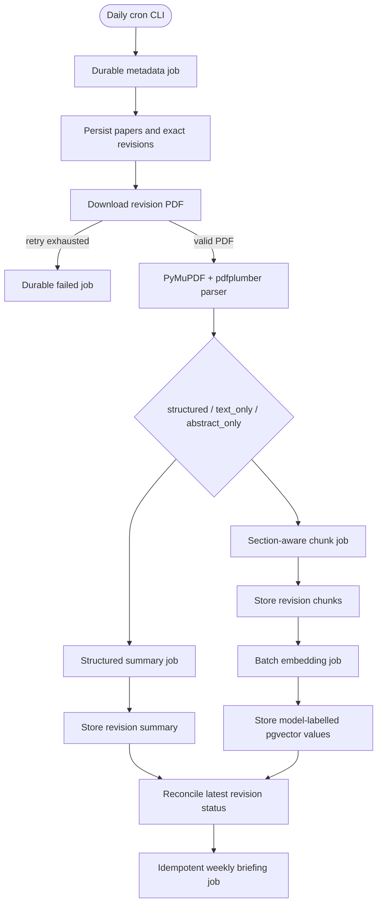
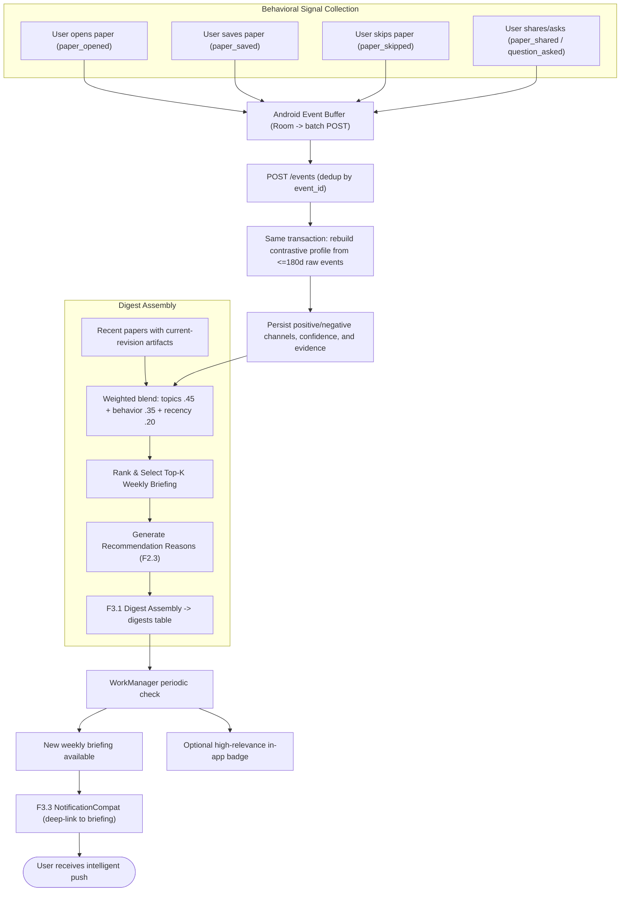
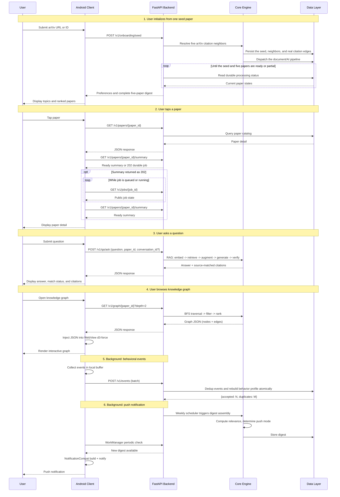

# MNEME

A mobile-native AI research agent. Mneme reads papers from arXiv, learns a user's
research interests, and prepares personalized research briefings with source-grounded
Q&A and citation-graph exploration.

Engineering sources of truth:

- [`docs/api/openapi-v0.1.yaml`](docs/api/openapi-v0.1.yaml) -- frozen v0.1 API contract
- [`docs/architecture/data-model.md`](docs/architecture/data-model.md) -- ER model
- [`docs/architecture/graph-contract.md`](docs/architecture/graph-contract.md) -- graph boundary
- [`docs/architecture/pipeline-and-reliability.md`](docs/architecture/pipeline-and-reliability.md) -- jobs, evaluation, demo mode, observability
- [`docs/architecture/privacy-and-data.md`](docs/architecture/privacy-and-data.md) -- licensing, privacy, reproducibility
- [`docs/adr/0001-mvp-auth.md`](docs/adr/0001-mvp-auth.md) -- MVP authentication decision
- [`docs/adr/0002-m3-behavior-baseline.md`](docs/adr/0002-m3-behavior-baseline.md) -- deterministic behavior-v1 decision
- [`docs/adr/0003-behavior-v2.md`](docs/adr/0003-behavior-v2.md) -- confidence-calibrated contrastive behavior model
- [`docs/evaluation/behavior/README.md`](docs/evaluation/behavior/README.md) -- controlled behavior evaluation and claim boundary

Current implementation status (2026-07-24): `dev` contains the merged backend/data and
AI platform through Milestone 3, plus the live skeletal Android path. The backend
includes the v0.1 relational schema, demo-token authentication, arXiv metadata and
revision-safe document ingestion, durable jobs, provider-routed summarization,
section-aware chunking, embeddings, pgvector retrieval, single-paper Q&A,
recommendation/digest services, scheduling, recovery, caching, budget controls, and
deterministic evaluation and end-to-end coverage.

This checkout connects seed-paper onboarding -> Android briefing -> paper summary ->
single-paper Q&A -> arXiv source flow to those implemented REST APIs. It adds
Retrofit/OkHttp, frozen-contract DTOs, a production ViewModel, summary-job polling, and
Room-backed fallback with explicit data source labels. A blank Android demo token
deliberately selects the existing controlled fixture instead. Supported live interactions
are queued locally and uploaded through the frozen event contract, and paper details expose
the bounded citation graph. Seed onboarding now prefers five arXiv-resolvable citation
neighbors and persists their real edges before returning the briefing, so a selected
briefing paper can open the prepared multi-node neighborhood. The original same-category
selection remains the fallback when provider graph data is unavailable. Background digest
refresh and production authentication remain outside the Android integration. The backend
also provides explicit Semantic Scholar graph synchronization for other local papers,
bounded graph persistence/API, transactional behavior events, and confidence-calibrated
contrastive behavior profiles while retaining behavior-v1 replay.

---

## Getting Started

### Android Client (live skeletal integration in this checkout)

The Gradle manifests under `android/` are authoritative for installed versions. The client
uses Compose/Material 3, type-safe Navigation Compose, Room, DataStore, WorkManager,
kotlinx.serialization, Retrofit/OkHttp, and MVVM with a manual application container. Hilt,
notification permission UX, and live background synchronization remain later feature
units. The table below combines installed and target client dependencies.

| Dependency | Version | Purpose | Link |
|-----------|---------|---------|------|
| Kotlin | 2.0.21 | Development language | https://kotlinlang.org |
| Jetpack Compose | Current stable BOM | Declarative UI framework | https://developer.android.com/compose |
| Navigation Compose | 2.8+ | Type-safe route navigation | https://developer.android.com/guide/navigation |
| Hilt | Current stable | Dependency injection | https://dagger.dev/hilt |
| Retrofit + OkHttp | 3.0.0 + 4.12.0 | HTTP client and transport | https://square.github.io/retrofit |
| kotlinx.serialization | 1.7.3 | JSON serialization | https://github.com/Kotlin/kotlinx.serialization |
| Room + DataStore | Current stable | Local cache and preferences | https://developer.android.com/training/data-storage |
| WorkManager | Current stable | Background digest checks | https://developer.android.com/topic/libraries/architecture/workmanager |
| Coil | Current stable | Compose-native image loading | https://coil-kt.github.io/coil |
| d3.js | v7 (local bundle) | Force-directed graph rendering in WebView | https://d3js.org |
| CameraX | Current stable | Camera viewfinder (stretch: OCR) | https://developer.android.com/training/camerax |
| ML Kit Text Recognition | Current stable | On-device OCR (stretch) | https://developers.google.com/ml-kit/vision/text-recognition/v2 |

Build commands:

```bash
cd android
./gradlew assembleDebug        # Build debug APK
./gradlew test                  # Run unit tests
./gradlew ktlintCheck           # Lint check
```

### Backend (Milestone 3 platform available on this branch)

The backend includes FastAPI/Uvicorn, Pydantic settings, structlog, async SQLAlchemy/asyncpg, PostgreSQL/pgvector, Alembic, Redis/ARQ, a rate-limited arXiv client, revision-safe local document artifacts, PyMuPDF/pdfplumber parsing, provider-routed AI services, durable staged jobs, daily/weekly schedulers, and the test toolchain. See [`backend/README.md`](backend/README.md) for operational setup, recovery semantics, and current limitations.

| Dependency | Version | Purpose | Link |
|-----------|---------|---------|------|
| Python | 3.11+ | Development language | https://www.python.org |
| FastAPI + Uvicorn | Current compatible releases | Async REST API and development server | https://fastapi.tiangolo.com |
| Gunicorn | Planned; not currently installed | Production process manager after deployment packaging is defined | https://gunicorn.org |
| SQLAlchemy + asyncpg | SQLAlchemy 2.x | Async ORM and PostgreSQL driver | https://www.sqlalchemy.org |
| Alembic | Current compatible release | Database migrations | https://alembic.sqlalchemy.org |
| PostgreSQL + pgvector | PostgreSQL 16 baseline | Relational data and vector search | https://github.com/pgvector/pgvector |
| ARQ + Redis | Current compatible releases | Async jobs, broker, and cache | https://github.com/python-arq/arq |
| httpx | Current compatible release | Async HTTP client | https://www.python-httpx.org |
| PyMuPDF + pdfplumber | Current compatible releases | PDF text and structure extraction | https://pymupdf.readthedocs.io |
| OpenAI + Anthropic SDKs | Current compatible releases | Provider adapters for LLMs and embeddings | https://github.com/openai/openai-python |
| structlog | Current compatible release | Structured JSON logging | https://www.structlog.org |

Development commands:

```bash
cd backend
uv sync --locked --dev
uv run alembic upgrade head
# Configure the demo identity as described in backend/README.md first.
uv run python -m mneme.cli.bootstrap_demo_user
uv run python -m mneme.cli.fetch_arxiv cs.AI --max-results 20
uv run python -m mneme.tasks.fetch_daily
uv run python -m mneme.tasks.assemble_weekly
uv run uvicorn mneme.main:app --reload
uv run arq mneme.tasks.worker.WorkerSettings
uv run ruff format --check .
uv run ruff check .
uv run pyrefly check .
uv run pytest -m base
```

### External APIs

| Service | Purpose | Current usage policy | Link |
|---------|---------|----------------------|------|
| arXiv API | Paper metadata ingestion | At most one request every 3 seconds; identify the client, cache results, avoid parallel requests, and retry `429`/`503` with backoff | https://info.arxiv.org/help/api/user-manual.html |
| Semantic Scholar API | Citation graph data | Request an API key; the introductory authenticated limit is 1 request/second across endpoints. Unauthenticated traffic shares a public pool and may be throttled | https://www.semanticscholar.org/product/api |
| OpenAI API | Summarization, Q&A, and embeddings | Limits vary by organization, usage tier, model, and endpoint; read response headers and configure retries/budgets at runtime | https://platform.openai.com/docs/guides/rate-limits |
| Anthropic API | Summarization and quality-critical Q&A | Spend and request/token limits vary by usage tier and model; enforce provider-specific limits and exponential backoff | https://docs.anthropic.com/en/api/rate-limits |
| DeepSeek API | Configurable low-cost summarization and Q&A | Use the provider adapter, completion cache, non-thinking demo default, retry policy, and shared daily budget | https://api-docs.deepseek.com/ |

Model identifiers are configuration, not architecture. Do not hard-code a model name in
application logic: select models through environment-backed provider settings, record the
exact model snapshot with generated artifacts, and review availability and pricing before
each release. The initial evaluation candidates are a current low-cost text model for bulk
summarization, a stronger model for cited Q&A, and OpenAI `text-embedding-3-small` for
embeddings. Final choices are made from measured quality, latency, and cost.

### DevOps

| Tool | Purpose | Link |
|------|---------|------|
| Git + GitHub | Version control (monorepo) | https://github.com |
| GitHub Actions | CI: lint + test | https://github.com/features/actions |
| Nginx | Reverse proxy | https://nginx.org |
| systemd | Process management | https://systemd.io |
| pg_dump + cron | Daily database backup | https://www.postgresql.org/docs/16/app-pgdump.html |

---

## Model and Engine

The following sections describe the target MVP architecture, not the current scaffold.

### Story Map

The complete user experience is divided into five stages, aligned with Mneme's core
value proposition: **Read - Remember - Plan - Engage - Connect**.

| # | Stage | Code | Description |
|---|-------|------|-------------|
| 1 | Receiving New Papers | **READ** | System auto-fetches, parses, and understands papers |
| 2 | Learning Your Interests | **REMEMBER** | System learns and maintains a model of user interests |
| 3 | Planning What to Read | **PLAN** | System proactively pushes relevant papers to the user |
| 4 | Asking With Sources | **ENGAGE** | User reads, asks questions, and traces sources |
| 5 | Exploring Connections | **CONNECT** | User visually explores paper and concept connections |

#### Feature Distribution by Tier

| Tier | Stage 1: Receiving New Papers (READ) | Stage 2: Learning Your Interests (REMEMBER) | Stage 3: Planning What to Read (PLAN) | Stage 4: Asking With Sources (ENGAGE) | Stage 5: Exploring Connections (CONNECT) |
|------|--------------------------------------|---------------------------------------------|---------------------------------------|---------------------------------------|------------------------------------------|
| **Skeletal** | Fetch new arXiv papers, download PDFs, generate TLDR summaries | Seed paper sets initial interests | Assemble a manual briefing | Single-paper RAG Q&A | -- |
| **MVP** | Section-aware chunking, embeddings | Track opens / saves / shares, update user interest model, generate rec reasons | Weekly Research Briefing + periodic local notification | Structured summaries, source-matched Q&A citations, follow-up Q&A | Bounded paper-citation graph, mobile d3-force visualization |
| **Stretch** | On-device LLM research | -- | Shared team digest lists | Voice / camera input | Zotero / BibTeX export |

### Engine Architecture

Mneme uses a three-layer architecture: Android Client, FastAPI Backend, and
Core Engine with Data & AI pipelines.

```mermaid
graph TB
    subgraph Android["Android Client"]
        UI["Compose UI (MVVM + Hilt)"]
        LOCAL["Local Storage (Room + DataStore)"]
        NOTIF["Notification (WorkManager)"]
        WV["WebView (d3-force Graph)"]
    end

    subgraph Backend["FastAPI Backend"]
        API["REST API Layer (FastAPI + Pydantic)"]
        AUTH["Auth Dependency (Opaque Demo Bearer Token)"]
        TASK["Task Queue (ARQ + Redis)"]
    end

    subgraph Engine["Core Engine"]
        direction TB
        subgraph Ingestion["Paper Ingestion Pipeline"]
            ARXIV["arXiv Fetcher"]
            PDF["PDF Processor (PyMuPDF + pdfplumber)"]
            CHUNK["Section-Aware Chunker"]
        end
        subgraph AI["AI Pipeline"]
            SUMM["Provider-routed LLM Summarizer"]
            EMBED["Embedding Provider"]
            RAG["RAG Engine (Retrieve -> Augment -> Generate)"]
            REC["Recommendation Engine"]
        end
        subgraph Graph["Knowledge Graph"]
            KG_BUILD["Paper Citation Graph Builder"]
            KG_QUERY["Bounded Graph Query + Algorithm Fallback"]
        end
    end

    subgraph Data["Data Layer"]
        PG[("PostgreSQL (Users + Papers + Digests)")]
        PGV["pgvector (Chunk Embeddings)"]
        REDIS[("Redis (Cache + Task Queue)")]
        FS["File System (PDF Storage)"]
    end

    subgraph External["External Services"]
        ARXIV_API["arXiv API"]
        S2_API["Semantic Scholar API"]
        LLM_API["Claude / OpenAI API"]
        EMBED_API["OpenAI Embeddings API"]
    end

    Android -->|"REST/JSON"| API
    API --> AUTH
    API --> TASK
    API --> PG
    API --> PGV
    API --> REDIS

    TASK --> ARXIV
    ARXIV --> ARXIV_API
    ARXIV --> PG
    PDF --> FS
    PDF --> PG
    CHUNK --> PGV
    CHUNK --> PG

    SUMM --> LLM_API
    SUMM --> REDIS
    SUMM --> PG
    EMBED --> EMBED_API
    EMBED --> PGV

    RAG --> PGV
    RAG --> LLM_API
    RAG --> PG

    REC --> PGV
    REC --> PG
    REC --> REDIS

    KG_BUILD --> PG
    KG_BUILD --> S2_API
    KG_QUERY --> PG

    API --> WV
```



#### Layer Descriptions

**Android Client Layer** -- The presentation layer built with Jetpack Compose and MVVM
architecture. Communicates with the backend exclusively via REST/JSON over Retrofit + OkHttp.
Local persistence uses Room (relational cache for papers and digests) and DataStore
(key-value preferences). Background work (periodic digest check, notification triggering)
is handled by WorkManager. The knowledge graph visualization uses a WebView embedding
d3.js force-directed graph with a Kotlin-to-JavaScript bridge for gesture handling.

**FastAPI Backend Layer** -- The HTTP API layer. Protected requests use one
pre-provisioned opaque demo token in the Bearer header; login/JWT lifecycle is out of MVP.
Long-running tasks
(PDF download, summarization, embedding) are submitted to ARQ, an async Redis-backed
task queue, rather than executed synchronously in the request handler. The frozen v0.1
compatibility baseline lives under `docs/api/`; all frozen routes are now implemented, so
FastAPI-generated OpenAPI is the runtime source of truth. Contract tests compare operation
IDs and documented response schema references, while focused route/schema tests cover
reviewed runtime invariants; see `docs/api/README.md` for the exact governance boundary.

**Core Engine Layer** -- Contains three sub-pipelines:

- *Paper Ingestion Pipeline*: arXiv Fetcher pulls paper metadata daily (rate-limited,
  incremental). PDF Processor downloads PDFs asynchronously and extracts text (PyMuPDF)
  and structure (pdfplumber). The Section-Aware Chunker splits papers into retrieval-ready
  chunks by section boundaries rather than fixed token windows.

- *AI Pipeline*: The LLM Summarizer generates structured summaries (TLDR, key claims,
  methodology, and limitations) using a configurable low-cost model, gated by BudgetGuard
  for cost control. The Embedding Provider vectorizes chunks using the configured model
  and stores them in pgvector. The RAG Engine implements the Retrieve -> Augment ->
  Generate -> Source Match loop. The MVP verifies that cited chunks came from retrieval and
  measures citation coverage; it does not claim semantic entailment. Ruiyu freezes the
  versioned behavior-weight/decay baseline before M3, and the Recommendation Engine scores
  papers against that preference vector.

- *Knowledge Graph*: The MVP graph contains paper nodes and citation edges. Categories and
  keywords remain attributes. Queries default to depth 1 and 50 nodes; Yifan's weighting,
  clustering, and ranking algorithms fall back to a deterministic baseline graph.

**Data Layer** -- PostgreSQL stores all structured data (users, papers, digests, citations, user interactions, pipeline jobs, and provenance) with SQLAlchemy 2.x async ORM and Alembic migrations. The pgvector extension stores chunk embeddings in the same database instance, providing transactional consistency between structured and vector data. Redis serves dual roles as an LLM response cache and ARQ broker. The shared filesystem stores each source PDF and parsed sidecar under its paper UUID and paper-version UUID.

**External Services** -- arXiv provides paper metadata and Semantic Scholar provides
citation-graph data. OpenAI, Anthropic, and DeepSeek are accessed through provider adapters
so model selection can change without modifying pipeline logic. API clients enforce the policies
listed in External APIs, including caching, rate limiting, retries, and a hard daily budget.

#### Paper Data Pipeline (Detailed Flow)



**Key design decisions in the pipeline:**

- **Section-Aware Chunking**: Parser sections remain the semantic boundary, while oversized sections are split on sentence boundaries with configurable token limits and overlap (defaults: 450 tokens and 60 overlap tokens). Every chunk retains its exact paper revision, section, page range, hash, and model metadata.

- **Parse Quality Tiers**: `structured` records useful section structure, `text_only` records useful text with degraded structure, and `abstract_only` creates a single abstract section when the PDF is unusable. All three contracts can proceed through summary and chunk/embedding stages; degraded input results in a `partial` paper status.

- **BudgetGuard**: Before every LLM API call, the estimated cost is checked against the daily budget (`MNEME_AI_DAILY_BUDGET_USD`). If exceeded, the call is blocked and a safe failure is recorded.

#### Recommendation & Push Flow (Detailed Flow)



Recommendation scoring is a weighted average of explicit-topic match (`0.45`), same-model behavior-vector cosine similarity (`0.35`), and seven-day-half-life recency (`0.20`). When a preference or paper embedding is unavailable, its component is omitted and the remaining weights are renormalized. A manual recommended digest may be reused for up to 24 hours only if it is not older than the user's latest preference update.

**Push strategy explained:**

The notification bullets below describe the target Android integration policy; the current skeletal client does not yet perform live digest polling or issue data-backed recommendation notifications.

- **Weekly Batch** (default): A curated digest every Monday morning prevents
  notification fatigue. Users receive a single weekly notification rather than
  daily interruptions.

- **High-relevance badge** (experimental): A periodic check may surface a badge in the App,
  but the MVP does not promise immediate server push. FCM and conference alerts are future
  work.

- **Frequency Protection**: Same paper pushed at most once per 7 days. Maximum
  3 single-paper pushes per day. Excess pushes are suppressed and rolled into
  the next Weekly Batch.

---

## APIs and Controller

The Android client communicates with the FastAPI backend exclusively via RESTful JSON.
The frozen v0.1 compatibility baseline is [`docs/api/openapi-v0.1.yaml`](docs/api/openapi-v0.1.yaml); FastAPI's generated `/openapi.json` is authoritative for the running checkout.
Protected endpoints use the pre-provisioned opaque demo token in the
`Authorization: Bearer <token>` header; the MVP has no login or JWT lifecycle.

### Base URL

```
Development: http://localhost:8000/v1
Production:  https://<domain>/v1
```

### Endpoint Summary

| Method | Path | Purpose | Current status |
|--------|------|---------|----------------|
| `GET`  | `/v1/health` | Service health (no auth) | Implemented on `dev` |
| `GET`  | `/v1/papers` | Cursor-paginated papers | Implemented on `dev` |
| `GET`  | `/v1/papers/{paper_id}` | Get paper detail; `paper_id` is an internal UUID | Implemented on `dev` |
| `GET`  | `/v1/papers/{paper_id}/summary` | Ready revision summary or `202` durable job | Implemented on `dev` |
| `GET`  | `/v1/digests` | Cursor-paginated Research Briefings | Implemented on `dev` |
| `POST` | `/v1/digests/recommended` | Get or synchronously generate a manual recommended briefing | Implemented on `dev` |
| `POST` | `/v1/qa/ask` | Submit a single-paper RAG question | Implemented on `dev` |
| `POST` | `/v1/events` | Batch-upload behavioral tracking events | Implemented on this branch |
| `GET`  | `/v1/graph/{paper_id}` | Get a bounded paper-citation ego graph | Implemented on this branch |
| `GET`  | `/v1/users/me/preferences` | Get current user's interest preferences | Implemented on `dev` |
| `PUT`  | `/v1/users/me/preferences` | Replace explicit topics and followed authors | Implemented on `dev` |
| `POST` | `/v1/onboarding/seed` | Prepare a complete five-paper briefing from one arXiv seed | Implemented on `dev` |
| `GET`  | `/v1/jobs/{job_id}` | Poll durable asynchronous job state | Implemented on `dev` |

### Detailed Endpoint Specifications

Do not duplicate request/response schemas in this README. The frozen paths, parameters, status codes, and JSON shapes live in [`docs/api/openapi-v0.1.yaml`](docs/api/openapi-v0.1.yaml); implementation status and governance live in [`docs/api/README.md`](docs/api/README.md). FastAPI serves the generated schema at `/openapi.json` for the routes present in the running checkout.

### Communication Flow

The sequence below combines the implemented seed-paper Android walkthrough with the M3
integration contract. Backend paper, AI, scheduler/job, onboarding, event, and graph legs
exist in this checkout. Supported Android interactions use the event-sync path, and Android
graph rendering is connected; background digest refresh remains a separate workstream.



---

## View UI/UX

*This section is intentionally left blank. It will be populated with UI/UX design
in a later assignment.*

---

## Team Roster

| Name | Role | Responsibilities |
|------|------|-----------------|
| Hanyang Wang | Android Client Lead | App architecture, Compose skeleton, navigation, design system, Hilt DI, CI/CD |
| Heng Zhao | Android Features Engineer | Push notifications (WorkManager), knowledge graph visualization (WebView + d3-force), digest feed UI |
| Yifan Zhang | AI/RAG & Intelligence Features | LLM providers, summarization, chunking, embeddings, retrieval/reranking/generation, all AI endpoints, recommendations, graph algorithms, AI evaluation, and cost control |
| Ruiyu Jiang | Backend, Data & Behavior Platform | Core FastAPI platform/contracts, PostgreSQL/pgvector, ingestion, PDF parsing, queues, behavioral modeling, graph framework, reliability, deployment, and repository administration |

Backend boundary: Ruiyu owns shared contracts/middleware, non-AI routers, persistence,
pipeline infrastructure, behavioral modeling, the graph framework, and operations. Yifan
owns AI services and their `/summary`, `/qa`, and `/digest/recommended` routers. Ruiyu
provides graph storage/interfaces; Yifan owns graph weighting, clustering, and ranking.

---

## License

This project is licensed under the MIT License. See [LICENSE](./LICENSE) for the full license text.
