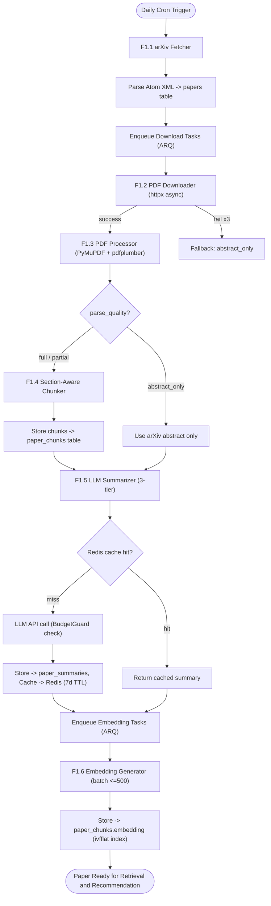
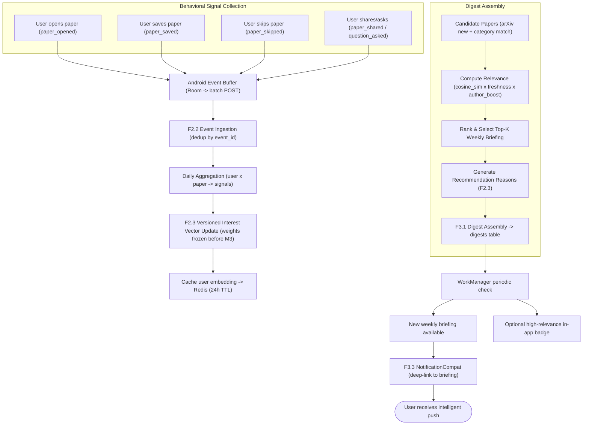
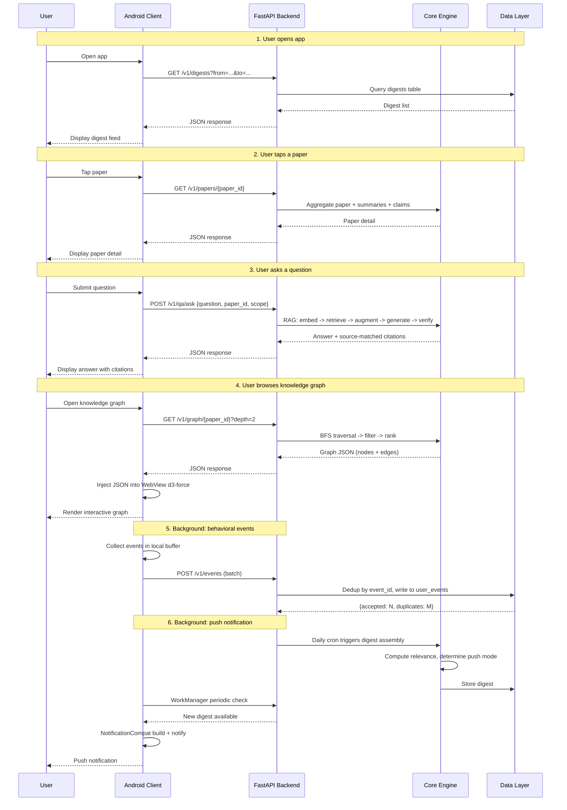

# MNEME

A mobile-native AI research agent. Mneme reads papers from arXiv, learns a user's
research interests, and prepares personalized research briefings with source-grounded
Q&A and citation-graph exploration.

Engineering sources of truth:

- [`docs/api/openapi-v0.1.yaml`](docs/api/openapi-v0.1.yaml) -- frozen v0.1 API contract
- [`docs/architecture/data-model.md`](docs/architecture/data-model.md) -- ER model
- [`docs/architecture/graph-contract.md`](docs/architecture/graph-contract.md) -- graph boundary
- [`docs/architecture/pipeline-and-reliability.md`](docs/architecture/pipeline-and-reliability.md) -- jobs, evaluation, demo mode, observability
- [`docs/architecture/privacy-and-data.md`](docs/architecture/privacy-and-data.md) -- licensing, privacy, reproducibility
- [`docs/adr/0001-mvp-auth.md`](docs/adr/0001-mvp-auth.md) -- MVP authentication decision

Current implementation status (2026-07-15): the Android scaffold and Milestone 1 backend
foundation are buildable. The backend now includes the v0.1 relational schema and migration,
demo-token authentication, shared error responses, rate-limited arXiv metadata ingestion,
paper catalog endpoints, explicit preferences, Redis infrastructure, and a minimal ARQ worker.
PDF processing, scheduled jobs, behavioral updates, graph algorithms, and AI features remain
later-milestone work.

---

## Getting Started

### Android Client (scaffold available)

The Gradle manifests under `android/` are authoritative for installed versions. The table
below describes the target client stack; dependencies not yet present are added with their
own feature units.

| Dependency | Version | Purpose | Link |
|-----------|---------|---------|------|
| Kotlin | 2.0.21 | Development language | https://kotlinlang.org |
| Jetpack Compose | Current stable BOM | Declarative UI framework | https://developer.android.com/compose |
| Navigation Compose | 2.8+ | Type-safe route navigation | https://developer.android.com/guide/navigation |
| Hilt | Current stable | Dependency injection | https://dagger.dev/hilt |
| Retrofit + OkHttp | Current stable | HTTP client and transport | https://square.github.io/retrofit |
| kotlinx.serialization | Current stable | JSON serialization | https://github.com/Kotlin/kotlinx.serialization |
| Room + DataStore | Current stable | Local cache and preferences | https://developer.android.com/training/data-storage |
| WorkManager | Current stable | Background digest checks | https://developer.android.com/topic/libraries/architecture/workmanager |
| Coil | Current stable | Compose-native image loading | https://coil-kt.github.io/coil |
| d3.js | v7 (local bundle) | Force-directed graph rendering in WebView | https://d3js.org |
| CameraX | Current stable | Camera viewfinder (stretch: OCR) | https://developer.android.com/training/camerax |
| ML Kit Text Recognition | Current stable | On-device OCR (stretch) | https://developers.google.com/ml-kit/vision/text-recognition/v2 |

Build commands:

```bash
cd android
./gradlew assembleDebug        # Build debug APK
./gradlew test                  # Run unit tests
./gradlew ktlintCheck           # Lint check
```

### Backend (Milestone 1 foundation available)

The current foundation includes FastAPI/Uvicorn, Pydantic settings, structlog, async
SQLAlchemy/asyncpg, PostgreSQL/pgvector, Alembic, Redis, ARQ, an arXiv Atom client, and the
test toolchain. Remaining libraries are added only with their owning feature.

| Dependency | Version | Purpose | Link |
|-----------|---------|---------|------|
| Python | 3.11+ | Development language | https://www.python.org |
| FastAPI + Uvicorn | Current compatible releases | Async REST API and development server | https://fastapi.tiangolo.com |
| Gunicorn | Current compatible release | Production process manager | https://gunicorn.org |
| SQLAlchemy + asyncpg | SQLAlchemy 2.x | Async ORM and PostgreSQL driver | https://www.sqlalchemy.org |
| Alembic | Current compatible release | Database migrations | https://alembic.sqlalchemy.org |
| PostgreSQL + pgvector | PostgreSQL 16 baseline | Relational data and vector search | https://github.com/pgvector/pgvector |
| ARQ + Redis | Current compatible releases | Async jobs, broker, and cache | https://github.com/python-arq/arq |
| httpx | Current compatible release | Async HTTP client | https://www.python-httpx.org |
| PyMuPDF + pdfplumber | Current compatible releases | PDF text and structure extraction | https://pymupdf.readthedocs.io |
| OpenAI + Anthropic SDKs | Current compatible releases | Provider adapters for LLMs and embeddings | https://github.com/openai/openai-python |
| structlog | Current compatible release | Structured JSON logging | https://www.structlog.org |

Development commands:

```bash
cd backend
uv sync --locked --dev
uv run alembic upgrade head
# Configure the demo identity as described in backend/README.md first.
uv run python -m mneme.cli.bootstrap_demo_user
uv run python -m mneme.cli.fetch_arxiv cs.AI --max-results 20
uv run uvicorn mneme.main:app --reload
uv run arq mneme.tasks.worker.WorkerSettings
uv run ruff format --check .
uv run ruff check .
uv run pyrefly check .
uv run pytest -m base
```

### External APIs

| Service | Purpose | Current usage policy | Link |
|---------|---------|----------------------|------|
| arXiv API | Paper metadata ingestion | At most one request every 3 seconds; identify the client, cache results, avoid parallel requests, and retry `429`/`503` with backoff | https://info.arxiv.org/help/api/user-manual.html |
| Semantic Scholar API | Citation graph data | Request an API key; the introductory authenticated limit is 1 request/second across endpoints. Unauthenticated traffic shares a public pool and may be throttled | https://www.semanticscholar.org/product/api |
| OpenAI API | Summarization, Q&A, and embeddings | Limits vary by organization, usage tier, model, and endpoint; read response headers and configure retries/budgets at runtime | https://platform.openai.com/docs/guides/rate-limits |
| Anthropic API | Summarization and quality-critical Q&A | Spend and request/token limits vary by usage tier and model; enforce provider-specific limits and exponential backoff | https://docs.anthropic.com/en/api/rate-limits |

Model identifiers are configuration, not architecture. Do not hard-code a model name in
application logic: select models through environment-backed provider settings, record the
exact model snapshot with generated artifacts, and review availability and pricing before
each release. The initial evaluation candidates are a current low-cost text model for bulk
summarization, a stronger model for cited Q&A, and OpenAI `text-embedding-3-small` for
embeddings. Final choices are made from measured quality, latency, and cost.

### DevOps

| Tool | Purpose | Link |
|------|---------|------|
| Git + GitHub | Version control (monorepo) | https://github.com |
| GitHub Actions | CI: lint + test | https://github.com/features/actions |
| Nginx | Reverse proxy | https://nginx.org |
| systemd | Process management | https://systemd.io |
| pg_dump + cron | Daily database backup | https://www.postgresql.org/docs/16/app-pgdump.html |

---

## Model and Engine

The following sections describe the target MVP architecture, not the current scaffold.

### Story Map

The complete user experience is divided into five stages, aligned with Mneme's core
value proposition: **Read - Remember - Plan - Engage - Connect**.

| # | Stage | Code | Description |
|---|-------|------|-------------|
| 1 | Receiving New Papers | **READ** | System auto-fetches, parses, and understands papers |
| 2 | Learning Your Interests | **REMEMBER** | System learns and maintains a model of user interests |
| 3 | Planning What to Read | **PLAN** | System proactively pushes relevant papers to the user |
| 4 | Asking With Sources | **ENGAGE** | User reads, asks questions, and traces sources |
| 5 | Exploring Connections | **CONNECT** | User visually explores paper and concept connections |

#### Feature Distribution by Tier

| Tier | Stage 1: Receiving New Papers (READ) | Stage 2: Learning Your Interests (REMEMBER) | Stage 3: Planning What to Read (PLAN) | Stage 4: Asking With Sources (ENGAGE) | Stage 5: Exploring Connections (CONNECT) |
|------|--------------------------------------|---------------------------------------------|---------------------------------------|---------------------------------------|------------------------------------------|
| **Skeletal** | Fetch new arXiv papers, download PDFs, generate TLDR summaries | Seed paper sets initial interests | Assemble a manual briefing | Single-paper RAG Q&A | -- |
| **MVP** | Section-aware chunking, embeddings | Track opens / saves / shares, update user interest model, generate rec reasons | Weekly Research Briefing + periodic local notification | Source-linked summaries, source-matched citations, follow-up Q&A | Bounded paper-citation graph, mobile d3-force visualization |
| **Stretch** | On-device LLM research | -- | Shared team digest lists | Voice / camera input | Zotero / BibTeX export |

### Engine Architecture

Mneme uses a three-layer architecture: Android Client, FastAPI Backend, and
Core Engine with Data & AI pipelines.

```mermaid
graph TB
    subgraph Android["Android Client"]
        UI["Compose UI (MVVM + Hilt)"]
        LOCAL["Local Storage (Room + DataStore)"]
        NOTIF["Notification (WorkManager)"]
        WV["WebView (d3-force Graph)"]
    end

    subgraph Backend["FastAPI Backend"]
        API["REST API Layer (FastAPI + Pydantic)"]
        AUTH["Auth Dependency (Opaque Demo Bearer Token)"]
        TASK["Task Queue (ARQ + Redis)"]
    end

    subgraph Engine["Core Engine"]
        direction TB
        subgraph Ingestion["Paper Ingestion Pipeline"]
            ARXIV["arXiv Fetcher"]
            PDF["PDF Processor (PyMuPDF + pdfplumber)"]
            CHUNK["Section-Aware Chunker"]
        end
        subgraph AI["AI Pipeline"]
            SUMM["Provider-routed LLM Summarizer"]
            EMBED["Embedding Provider"]
            RAG["RAG Engine (Retrieve -> Augment -> Generate)"]
            REC["Recommendation Engine"]
        end
        subgraph Graph["Knowledge Graph"]
            KG_BUILD["Paper Citation Graph Builder"]
            KG_QUERY["Bounded Graph Query + Algorithm Fallback"]
        end
    end

    subgraph Data["Data Layer"]
        PG[("PostgreSQL (Users + Papers + Digests)")]
        PGV["pgvector (Chunk Embeddings)"]
        REDIS[("Redis (Cache + Task Queue)")]
        FS["File System (PDF Storage)"]
    end

    subgraph External["External Services"]
        ARXIV_API["arXiv API"]
        S2_API["Semantic Scholar API"]
        LLM_API["Claude / OpenAI API"]
        EMBED_API["OpenAI Embeddings API"]
    end

    Android -->|"REST/JSON"| API
    API --> AUTH
    API --> TASK
    API --> PG
    API --> PGV
    API --> REDIS

    TASK --> ARXIV
    ARXIV --> ARXIV_API
    ARXIV --> PG
    PDF --> FS
    PDF --> PG
    CHUNK --> PGV
    CHUNK --> PG

    SUMM --> LLM_API
    SUMM --> REDIS
    SUMM --> PG
    EMBED --> EMBED_API
    EMBED --> PGV

    RAG --> PGV
    RAG --> LLM_API
    RAG --> PG

    REC --> PGV
    REC --> PG
    REC --> REDIS

    KG_BUILD --> PG
    KG_BUILD --> S2_API
    KG_QUERY --> PG

    API --> WV
```



#### Layer Descriptions

**Android Client Layer** -- The presentation layer built with Jetpack Compose and MVVM
architecture. Communicates with the backend exclusively via REST/JSON over Retrofit + OkHttp.
Local persistence uses Room (relational cache for papers and digests) and DataStore
(key-value preferences). Background work (periodic digest check, notification triggering)
is handled by WorkManager. The knowledge graph visualization uses a WebView embedding
d3.js force-directed graph with a Kotlin-to-JavaScript bridge for gesture handling.

**FastAPI Backend Layer** -- The HTTP API layer. Protected requests use one
pre-provisioned opaque demo token in the Bearer header; login/JWT lifecycle is out of MVP.
Long-running tasks
(PDF download, summarization, embedding) are submitted to ARQ, an async Redis-backed
task queue, rather than executed synchronously in the request handler. The frozen v0.1
contract lives under `docs/api/`; FastAPI-generated OpenAPI becomes authoritative after all
frozen routes are implemented and verified.

**Core Engine Layer** -- Contains three sub-pipelines:

- *Paper Ingestion Pipeline*: arXiv Fetcher pulls paper metadata daily (rate-limited,
  incremental). PDF Processor downloads PDFs asynchronously and extracts text (PyMuPDF)
  and structure (pdfplumber). The Section-Aware Chunker splits papers into retrieval-ready
  chunks by section boundaries rather than fixed token windows.

- *AI Pipeline*: The LLM Summarizer generates three-tier summaries (TLDR / structured /
  claims with source links) using a configurable low-cost model, gated by BudgetGuard
  for cost control. The Embedding Provider vectorizes chunks using the configured model
  and stores them in pgvector. The RAG Engine implements the Retrieve -> Augment ->
  Generate -> Source Match loop. The MVP verifies that cited chunks came from retrieval and
  measures citation coverage; it does not claim semantic entailment. Ruiyu freezes the
  versioned behavior-weight/decay baseline before M3, and the Recommendation Engine scores
  papers against that preference vector.

- *Knowledge Graph*: The MVP graph contains paper nodes and citation edges. Categories and
  keywords remain attributes. Queries default to depth 1 and 50 nodes; Yifan's weighting,
  clustering, and ranking algorithms fall back to a deterministic baseline graph.

**Data Layer** -- PostgreSQL stores all structured data (users, papers, digests, citations,
user interactions) with SQLAlchemy 2.x async ORM and Alembic migrations. The pgvector
extension stores chunk embeddings in the same database instance, providing transactional
consistency between structured and vector data. Redis serves dual roles: LLM response
cache (7-day TTL per paper-model pair) and ARQ task queue broker. The filesystem stores
downloaded PDFs organized by year/month.

**External Services** -- arXiv provides paper metadata and Semantic Scholar provides
citation-graph data. OpenAI and Anthropic are accessed through provider adapters so model
selection can change without modifying pipeline logic. API clients enforce the policies
listed in External APIs, including caching, rate limiting, retries, and a hard daily budget.

#### Paper Data Pipeline (Detailed Flow)



**Key design decisions in the pipeline:**

- **Section-Aware Chunking**: Uses pdfplumber-identified sections as atomic units.
  A section is never split; only sections exceeding 512 tokens are sub-divided,
  with 1-2 sentences of overlap between sub-chunks. This preserves the logical
  structure of academic papers ("Methods" and "Experiments" remain in separate,
  coherent chunks).

- **Parse Quality Tiers**: `full` (complete sections, sufficient text) routes through
  the full pipeline. `partial` (text present, no structure) uses degraded chunking
  by paragraph boundaries. `abstract_only` (PDF unextractable) skips chunking and
  uses only the arXiv abstract for TLDR generation.

- **BudgetGuard**: Before every LLM API call, the estimated cost is checked against
  the daily budget (env var `LLM_DAILY_BUDGET_USD`). If exceeded, the call is blocked
  and an alert is logged. Prevents accidental cost explosions from dev-loop bugs.

#### Recommendation & Push Flow (Detailed Flow)



**Push strategy explained:**

- **Weekly Batch** (default): A curated digest every Monday morning prevents
  notification fatigue. Users receive a single weekly notification rather than
  daily interruptions.

- **High-relevance badge** (experimental): A periodic check may surface a badge in the App,
  but the MVP does not promise immediate server push. FCM and conference alerts are future
  work.

- **Frequency Protection**: Same paper pushed at most once per 7 days. Maximum
  3 single-paper pushes per day. Excess pushes are suppressed and rolled into
  the next Weekly Batch.

---

## APIs and Controller

The Android client communicates with the FastAPI backend exclusively via RESTful JSON.
The authoritative frozen contract is [`docs/api/openapi-v0.1.yaml`](docs/api/openapi-v0.1.yaml).
Protected endpoints use the pre-provisioned opaque demo token in the
`Authorization: Bearer <token>` header; the MVP has no login or JWT lifecycle.

### Base URL

```
Development: http://localhost:8000/v1
Production:  https://<domain>/v1
```

### Endpoint Summary

| Method | Path | Purpose | Tier |
|--------|------|---------|------|
| `GET`  | `/v1/health` | Service health (no auth) | Skeletal |
| `GET`  | `/v1/papers` | Cursor-paginated papers | Skeletal |
| `GET`  | `/v1/papers/{paper_id}` | Get paper detail; `paper_id` is an internal UUID | Skeletal |
| `GET`  | `/v1/papers/{paper_id}/summary` | Ready summary or `202` async job | Skeletal |
| `GET`  | `/v1/digests` | Cursor-paginated Research Briefings | Skeletal |
| `POST` | `/v1/digests/recommended` | Get or enqueue a recommended briefing | MVP |
| `POST` | `/v1/qa/ask` | Submit a question for RAG-based answer | Skeletal |
| `POST` | `/v1/events` | Batch-upload behavioral tracking events | MVP |
| `GET`  | `/v1/graph/{paper_id}` | Get a bounded paper-citation ego graph | MVP |
| `GET`  | `/v1/users/me/preferences` | Get current user's interest preferences | Skeletal |
| `PUT`  | `/v1/users/me/preferences` | Update user's keywords, authors, categories | Skeletal |
| `GET`  | `/v1/jobs/{job_id}` | Poll an asynchronous job | Skeletal |

### Detailed Endpoint Specifications

#### GET /v1/digests

Returns a paginated list of digests for the authenticated user.

*Request Parameters*

| Key | Location | Type | Description |
|-----|----------|------|-------------|
| `cursor` | Query | String | Opaque continuation cursor (optional) |
| `limit` | Query | Integer | Items per page (default 20, max 50) |

*Response Codes*

| Code | Description |
|------|-------------|
| `200 OK` | Success |
| `400 Bad Request` | Invalid cursor or limit |
| `401 Unauthorized` | Missing or invalid token |

*Returns*

| Key | Type | Description |
|-----|------|-------------|
| `items` | Array[Digest] | List of digest summaries |
| `next_cursor` | String/null | Opaque cursor for the next page |

Digest object structure:

| Key | Type | Description |
|-----|------|-------------|
| `id` | String (UUID) | Digest unique identifier |
| `generated_at` | String (ISO 8601 UTC) | Briefing generation timestamp |
| `digest_type` | String | `weekly` / `manual` |
| `entries` | Array[DigestEntry] | Recommended papers in ranked order |

DigestEntry object structure:

| Key | Type | Description |
|-----|------|-------------|
| `paper_id` | String (UUID) | Internal paper identifier |
| `title` | String | Paper title |
| `authors` | Array[String] | Author names |
| `tldr` | String | One-sentence TLDR summary (<=30 words) |
| `recommendation_reason` | String | Why this paper was recommended |
| `relevance_score` | Float | Relevance score [0, 1] |

*Example*

```
curl -H "Authorization: Bearer <token>" \
     "https://SERVER/v1/digests?limit=3"

{
    "items": [
        {
            "id": "d290f1ee-6c54-4b01-90e6-d701748f0851",
            "generated_at": "2026-06-23T08:00:00Z",
            "digest_type": "weekly",
            "entries": [
                {
                    "paper_id": "c83bf7d8-9ed9-4f70-8fb1-9ffdb97798ec",
                    "title": "Sample Paper Title",
                    "authors": ["Author A", "Author B"],
                    "tldr": "This paper proposes a novel method for...",
                    "recommendation_reason": "Highly relevant to your followed [reinforcement learning]",
                    "relevance_score": 0.92
                }
            ]
        }
    ],
    "next_cursor": null
}
```

#### POST /v1/qa/ask

Submits a single-paper question for grounded RAG answering.

*Request Body*

| Key | Type | Description |
|-----|------|-------------|
| `question` | String | The user's question (1-500 chars) |
| `paper_id` | String (UUID) | Required internal paper identifier |
| `conversation_id` | String (UUID, optional) | For multi-turn follow-up; reuses dialogue context |

*Response Codes*

| Code | Description |
|------|-------------|
| `200 OK` | Answer generated |
| `400 Bad Request` | Empty question or invalid paper ID |
| `402 Payment Required` | LLM daily budget exceeded |
| `503 Service Unavailable` | LLM API unavailable after retries |

*Returns*

| Key | Type | Description |
|-----|------|-------------|
| `answer` | String | The generated answer text |
| `citations` | Array[Citation] | Source-matched citations |
| `source_match_status` | String | `matched`, `partial`, or `insufficient_evidence` |
| `retrieved_chunks` | Integer | Number of chunks retrieved |
| `conversation_id` | String (UUID) | For continuing multi-turn dialogue |

Citation object structure:

| Key | Type | Description |
|-----|------|-------------|
| `paper_title` | String | Source paper title |
| `authors` | String | First author et al. |
| `arxiv_id` | String | arXiv identifier |
| `section_title` | String | Section where the cited claim originates |
| `source_match` | Boolean | Whether the citation identifies a chunk retrieved for this answer |

*Example*

```
curl -X POST -H "Authorization: Bearer <token>" \
     -H "Content-Type: application/json" \
     -d '{"question": "What is the main contribution of this paper?", "paper_id": "d290f1ee-6c54-4b01-90e6-d701748f0851"}' \
     https://SERVER/v1/qa/ask

{
    "answer": "The main contribution of this paper is a novel attention mechanism that reduces computational complexity from O(n^2) to O(n log n) while maintaining accuracy...",
    "citations": [
        {
            "paper_title": "Sample Paper Title",
            "authors": "Author A et al.",
            "arxiv_id": "2301.12345",
            "section_title": "3. Method",
            "source_match": true
        }
    ],
    "source_match_status": "matched",
    "retrieved_chunks": 5,
    "conversation_id": "b7e14c8a-3f2d-4a1b-9c5e-6f8d7a2b3c1d"
}
```

#### GET /v1/papers/{paper_id}

Returns full paper details with summaries, source links, and citation statistics.

*Path Parameters*

| Key | Type | Description |
|-----|------|-------------|
| `paper_id` | String (UUID) | Internal paper identifier; arXiv ID remains a separate field |

*Returns*

| Key | Type | Description |
|-----|------|-------------|
| `arxiv_id` | String | Paper identifier |
| `title` | String | Full paper title |
| `authors` | Array[String] | Author names |
| `abstract` | String | Original arXiv abstract |
| `category` | String | Primary arXiv category |
| `publish_date` | String (YYYY-MM-DD) | Publication date |
| `tldr` | String | AI-generated TLDR (<=30 words) |
| `structured_summary` | Object | Section-level structured summary |
| `claims` | Array[Claim] | Key findings with source links |
| `figures` | Array[FigureCaption] | Extracted figure/table captions |
| `citation_stats` | Object | Cited-by count, reference count, influential count |

Claim object (`claims[]`):

| Key | Type | Description |
|-----|------|-------------|
| `claim_text` | String | The key finding or claim |
| `source_section` | String | Section where this claim originates |
| `source_paragraph_index` | Integer | Paragraph index within the section |
| `confidence` | String | `high` / `medium` / `low` |

#### POST /v1/events

Batch-upload behavioral tracking events from the Android client. Idempotent:
duplicate `event_id` values are silently skipped.

*Request Body* -- Array of event objects:

| Key | Type | Description |
|-----|------|-------------|
| `event_id` | String (UUIDv4) | Client-generated unique event ID |
| `event_type` | String | `paper_opened` / `paper_saved` / `paper_skipped` / `paper_shared` / `question_asked` / `digest_dismissed` |
| `paper_id` | String | arXiv ID of the paper (nullable for digest_dismissed) |
| `timestamp` | String (ISO 8601) | Event occurrence time |
| `duration_ms` | Integer (optional) | Reading duration for paper_opened events |
| `context` | Object (optional) | Additional event metadata |

*Response Codes*

| Code | Description |
|------|-------------|
| `200 OK` | Batch processed |
| `400 Bad Request` | Invalid event format |
| `413 Payload Too Large` | Batch exceeds 500 events |

*Returns*

| Key | Type | Description |
|-----|------|-------------|
| `accepted` | Integer | Number of events ingested |
| `duplicates` | Integer | Number of duplicate event_ids skipped |

#### GET /v1/graph/{paper_id}

Returns ego-network citation graph data for visualization.

*Path Parameters*

| Key | Type | Description |
|-----|------|-------------|
| `paper_id` | String (UUID) | Internal center-paper identifier |

*Query Parameters*

| Key | Type | Description |
|-----|------|-------------|
| `depth` | Integer | Traversal depth (1 or 2, default: 1) |
| `limit` | Integer | Maximum nodes (default 50, hard maximum 200) |

*Returns*

| Key | Type | Description |
|-----|------|-------------|
| `nodes` | Array[GraphNode] | Paper nodes in the ego-network (<=200) |
| `edges` | Array[GraphEdge] | Citation relationship edges |
| `center_id` | String | The queried center paper |
| `algorithm_status` | String | `ready` or deterministic `fallback` |
| `graph_version` | String/null | Version of Yifan's graph algorithm |

GraphNode structure:

| Key | Type | Description |
|-----|------|-------------|
| `id` | String (UUID) | Internal paper ID |
| `title` | String | Paper title |
| `authors` | String | First author et al. |
| `year` | Integer | Publication year |
| `category` | String | arXiv primary category |
| `citation_count` | Integer | Total citation count |
| `cluster_id` | String/null | Optional algorithm-assigned cluster |
| `rank_score` | Float/null | Optional algorithm-assigned rank |

GraphEdge structure:

| Key | Type | Description |
|-----|------|-------------|
| `source` | String (UUID) | Citing paper ID |
| `target` | String (UUID) | Cited paper ID |
| `weight` | Float/null | Optional versioned algorithm weight |

### Communication Flow



---

## View UI/UX

*This section is intentionally left blank. It will be populated with UI/UX design
in a later assignment.*

---

## Team Roster

| Name | Role | Responsibilities |
|------|------|-----------------|
| Hanyang Wang | Android Client Lead | App architecture, Compose skeleton, navigation, design system, Hilt DI, CI/CD |
| Heng Zhao | Android Features Engineer | Push notifications (WorkManager), knowledge graph visualization (WebView + d3-force), digest feed UI |
| Yifan Zhang | AI/RAG & Intelligence Features | LLM providers, summarization, chunking, embeddings, retrieval/reranking/generation, all AI endpoints, recommendations, graph algorithms, AI evaluation, and cost control |
| Ruiyu Jiang | Backend, Data & Behavior Platform | Core FastAPI platform/contracts, PostgreSQL/pgvector, ingestion, PDF parsing, queues, behavioral modeling, graph framework, reliability, deployment, and repository administration |

Backend boundary: Ruiyu owns shared contracts/middleware, non-AI routers, persistence,
pipeline infrastructure, behavioral modeling, the graph framework, and operations. Yifan
owns AI services and their `/summary`, `/qa`, and `/digest/recommended` routers. Ruiyu
provides graph storage/interfaces; Yifan owns graph weighting, clustering, and ranking.

---

## License

This project is licensed under the MIT License. See [LICENSE](./LICENSE) for the full license text.
