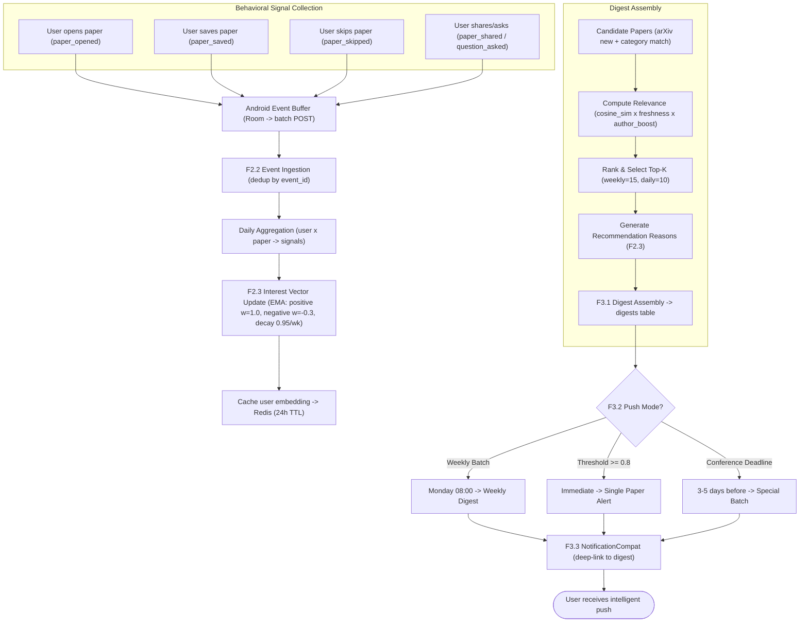
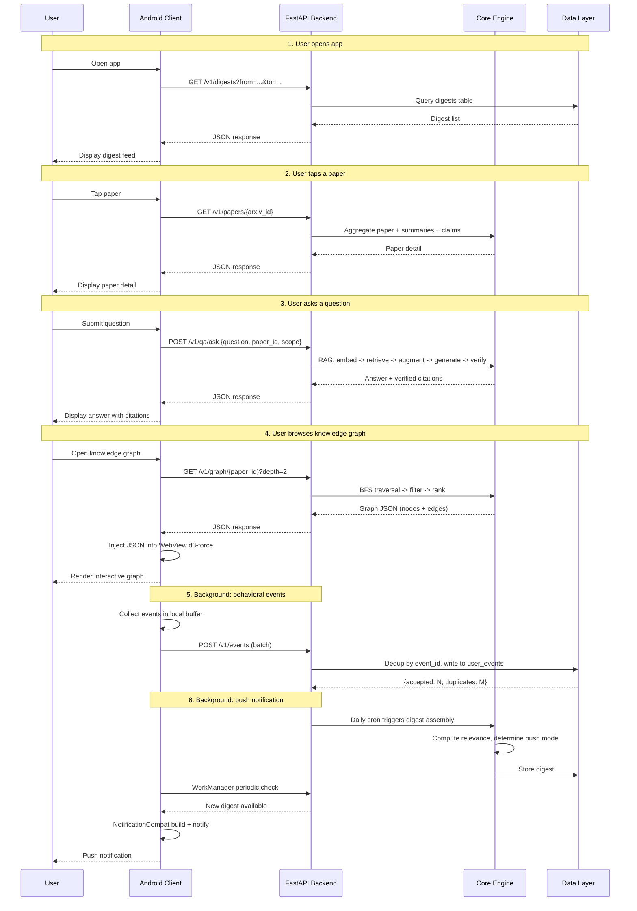

# MNEME

A mobile-native AI research agent. Reads papers from arXiv, remembers user interests
via a personal knowledge graph, and plans daily digests.

---

## Getting Started

### Android Client

| Dependency | Version | Purpose | Link |
|-----------|---------|---------|------|
| Kotlin | 1.9+ | Development language | https://kotlinlang.org |
| Jetpack Compose | BOM 2024+ | Declarative UI framework | https://developer.android.com/compose |
| Navigation Compose | 2.8+ | Type-safe route navigation | https://developer.android.com/guide/navigation |
| Hilt | 1.2+ | Dependency injection | https://dagger.dev/hilt |
| Retrofit 2 | 2.11+ | HTTP client | https://square.github.io/retrofit |
| OkHttp 4 | 4.12+ | HTTP transport + interceptors | https://square.github.io/okhttp |
| kotlinx.serialization | 1.7+ | JSON serialization | https://github.com/Kotlin/kotlinx.serialization |
| Room | 2.6+ | Local relational database | https://developer.android.com/training/data-storage/room |
| DataStore | 1.1+ | Key-value preferences storage | https://developer.android.com/topic/libraries/architecture/datastore |
| WorkManager | 2.9+ | Background task scheduling | https://developer.android.com/topic/libraries/architecture/workmanager |
| Coil 3 | 3.0+ | Image loading (Compose-native) | https://coil-kt.github.io/coil |
| d3.js | v7 (local bundle) | Force-directed graph rendering in WebView | https://d3js.org |
| CameraX | 1.4+ | Camera viewfinder (Stretch: OCR) | https://developer.android.com/training/camerax |
| ML Kit Text Recognition | 16.0+ | On-device OCR (Stretch) | https://developers.google.com/ml-kit/vision/text-recognition/v2 |

Build commands:

```bash
cd mneme-android
./gradlew assembleDebug        # Build debug APK
./gradlew test                  # Run unit tests
./gradlew ktlintCheck           # Lint check
```

### Backend (Python)

| Dependency | Version | Purpose | Link |
|-----------|---------|---------|------|
| Python | 3.11+ | Development language | https://www.python.org |
| FastAPI | 0.115+ | Async REST API framework | https://fastapi.tiangolo.com |
| uvicorn | 0.32+ | ASGI dev server | https://www.uvicorn.org |
| gunicorn | 22+ | ASGI production server | https://gunicorn.org |
| SQLAlchemy | 2.0+ | Async ORM | https://www.sqlalchemy.org |
| Alembic | 1.14+ | Database migration | https://alembic.sqlalchemy.org |
| pgvector | 0.7+ (PG ext) | Vector storage and ANN search | https://github.com/pgvector/pgvector |
| asyncpg | 0.30+ | PostgreSQL async driver | https://github.com/MagicStack/asyncpg |
| ARQ | 0.26+ | Async Redis-based task queue | https://github.com/python-arq/arq |
| Redis | 7.2+ (server) | Cache + task queue broker | https://redis.io |
| httpx | 0.28+ | Async HTTP client | https://www.python-httpx.org |
| PyMuPDF | 1.24+ | PDF text extraction (C backend) | https://pymupdf.readthedocs.io |
| pdfplumber | 0.11+ | PDF structure extraction | https://github.com/jsvine/pdfplumber |
| tiktoken | 0.8+ | Token counting (OpenAI codec) | https://github.com/openai/tiktoken |
| openai (official SDK) | 1.58+ | OpenAI API client | https://github.com/openai/openai-python |
| anthropic (official SDK) | 0.40+ | Anthropic Claude API client | https://github.com/anthropics/anthropic-sdk-python |
| structlog | 24.4+ | Structured JSON logging | https://www.structlog.org |

Build commands:

```bash
cd mneme-backend
python -m venv .venv && source .venv/bin/activate
pip install -r requirements.txt
uvicorn main:app --reload             # Dev server
ruff check . && black --check .       # Lint + format check
pytest                                # Run tests
```

### External APIs

| Service | Purpose | Rate Limit | Link |
|---------|---------|-----------|------|
| arXiv API | Paper metadata ingestion | 1 req/s | https://info.arxiv.org/help/api |
| Semantic Scholar API | Citation graph data | 100 req / 5 min (free tier) | https://api.semanticscholar.org |
| OpenAI API | LLM summarization + text embeddings | 500K TPM (tier 1) | https://platform.openai.com/docs |
| Anthropic Claude API | Q&A generation (quality-critical) | Tier-graded | https://docs.anthropic.com |

### DevOps

| Tool | Purpose | Link |
|------|---------|------|
| Git + GitHub | Version control (monorepo) | https://github.com |
| GitHub Actions | CI: lint + test | https://github.com/features/actions |
| Nginx | Reverse proxy | https://nginx.org |
| systemd | Process management | https://systemd.io |
| pg_dump + cron | Daily database backup | -- |

---

## Model and Engine

### Story Map

The complete user experience is divided into five stages, aligned with Mneme's core
value proposition: **Read - Remember - Plan - Engage - Connect**.

| # | Stage | Code | Description |
|---|-------|------|-------------|
| 1 | Receiving New Papers | **READ** | System auto-fetches, parses, and understands papers |
| 2 | Learning Your Interests | **REMEMBER** | System learns and maintains a model of user interests |
| 3 | Planning What to Read | **PLAN** | System proactively pushes relevant papers to the user |
| 4 | Asking With Sources | **ENGAGE** | User reads, asks questions, and traces sources |
| 5 | Exploring Connections | **CONNECT** | User visually explores paper and concept connections |

#### Feature Distribution by Tier

| Tier | Stage 1: Receiving New Papers (READ) | Stage 2: Learning Your Interests (REMEMBER) | Stage 3: Planning What to Read (PLAN) | Stage 4: Asking With Sources (ENGAGE) | Stage 5: Exploring Connections (CONNECT) |
|------|--------------------------------------|---------------------------------------------|---------------------------------------|---------------------------------------|------------------------------------------|
| **Skeletal** | Fetch new arXiv papers, download PDFs, generate TLDR summaries | Seed paper sets initial interests | Assemble daily digest | Single-paper RAG Q&A | -- |
| **MVP** | Section-aware chunking, embeddings | Track opens / saves / shares, update user interest model, generate rec reasons | Weekly + threshold push alerts, share papers with deep links | Source-linked summaries, verified citations, follow-up Q&A | Build citation graph, traverse + filter graph, mobile d3-force visualization |
| **Stretch** | On-device LLM research | -- | Shared team digest lists | Voice / camera input | Zotero / BibTeX export |

### Engine Architecture

Mneme uses a three-layer architecture: Android Client, FastAPI Backend, and
Core Engine with Data & AI pipelines.

```mermaid
graph TB
    subgraph Android["Android Client"]
        UI["Compose UI (MVVM + Hilt)"]
        LOCAL["Local Storage (Room + DataStore)"]
        NOTIF["Notification (WorkManager)"]
        WV["WebView (d3-force Graph)"]
    end

    subgraph Backend["FastAPI Backend"]
        API["REST API Layer (FastAPI + Pydantic)"]
        AUTH["Auth Middleware (API Key / Token)"]
        TASK["Task Queue (ARQ + Redis)"]
    end

    subgraph Engine["Core Engine"]
        direction TB
        subgraph Ingestion["Paper Ingestion Pipeline"]
            ARXIV["arXiv Fetcher"]
            PDF["PDF Processor (PyMuPDF + pdfplumber)"]
            CHUNK["Section-Aware Chunker"]
        end
        subgraph AI["AI Pipeline"]
            SUMM["LLM Summarizer (Haiku / GPT-4o-mini)"]
            EMBED["Embedding Generator (text-embedding-3-small)"]
            RAG["RAG Engine (Retrieve -> Augment -> Generate)"]
            REC["Recommendation Engine"]
        end
        subgraph Graph["Knowledge Graph"]
            KG_BUILD["Graph Builder (Citation + Concept)"]
            KG_QUERY["Graph Query (BFS / PageRank)"]
        end
    end

    subgraph Data["Data Layer"]
        PG[("PostgreSQL (Users + Papers + Digests)")]
        PGV["pgvector (Chunk Embeddings)"]
        REDIS[("Redis (Cache + Task Queue)")]
        FS["File System (PDF Storage)"]
    end

    subgraph External["External Services"]
        ARXIV_API["arXiv API"]
        S2_API["Semantic Scholar API"]
        LLM_API["Claude / OpenAI API"]
        EMBED_API["OpenAI Embeddings API"]
    end

    Android -->|"REST/JSON"| API
    API --> AUTH
    API --> TASK
    API --> PG
    API --> PGV
    API --> REDIS

    TASK --> ARXIV
    ARXIV --> ARXIV_API
    ARXIV --> PG
    PDF --> FS
    PDF --> PG
    CHUNK --> PGV
    CHUNK --> PG

    SUMM --> LLM_API
    SUMM --> REDIS
    SUMM --> PG
    EMBED --> EMBED_API
    EMBED --> PGV

    RAG --> PGV
    RAG --> LLM_API
    RAG --> PG

    REC --> PGV
    REC --> PG
    REC --> REDIS

    KG_BUILD --> PG
    KG_BUILD --> S2_API
    KG_QUERY --> PG

    API --> WV
```



#### Layer Descriptions

**Android Client Layer** -- The presentation layer built with Jetpack Compose and MVVM
architecture. Communicates with the backend exclusively via REST/JSON over Retrofit + OkHttp.
Local persistence uses Room (relational cache for papers and digests) and DataStore
(key-value preferences). Background work (periodic digest check, notification triggering)
is handled by WorkManager. The knowledge graph visualization uses a WebView embedding
d3.js force-directed graph with a Kotlin-to-JavaScript bridge for gesture handling.

**FastAPI Backend Layer** -- The HTTP API layer. All client requests pass through
the Auth Middleware (API Key / Bearer token validation). Long-running tasks
(PDF download, summarization, embedding) are submitted to ARQ, an async Redis-backed
task queue, rather than executed synchronously in the request handler. The API
specification is auto-generated as OpenAPI 3.0 by FastAPI.

**Core Engine Layer** -- Contains three sub-pipelines:

- *Paper Ingestion Pipeline*: arXiv Fetcher pulls paper metadata daily (rate-limited,
  incremental). PDF Processor downloads PDFs asynchronously and extracts text (PyMuPDF)
  and structure (pdfplumber). The Section-Aware Chunker splits papers into retrieval-ready
  chunks by section boundaries rather than fixed token windows.

- *AI Pipeline*: The LLM Summarizer generates three-tier summaries (TLDR / structured /
  claims with source links) using budget models (Haiku, GPT-4o-mini), gated by BudgetGuard
  for cost control. The Embedding Generator vectorizes chunks via text-embedding-3-small
  and stores them in pgvector. The RAG Engine implements the Retrieve -> Augment ->
  Generate -> Verify loop with post-generation citation verification. The Recommendation
  Engine updates user interest vectors via EMA based on behavioral signals and computes
  paper-user relevance scores.

- *Knowledge Graph*: The Graph Builder constructs ego-network citation graphs from
  Semantic Scholar data with concept clustering. Graph Query supports BFS traversal
  with filtering and PageRank-based node ranking.

**Data Layer** -- PostgreSQL stores all structured data (users, papers, digests, citations,
user interactions) with SQLAlchemy 2.x async ORM and Alembic migrations. The pgvector
extension stores chunk embeddings in the same database instance, providing transactional
consistency between structured and vector data. Redis serves dual roles: LLM response
cache (7-day TTL per paper-model pair) and ARQ task queue broker. The filesystem stores
downloaded PDFs organized by year/month.

**External Services** -- arXiv API provides paper metadata (free, 1 req/s).
Semantic Scholar API provides citation graph data (free tier, 100 req/5min).
OpenAI API handles bulk summarization (GPT-4o-mini) and text embeddings
(text-embedding-3-small). Anthropic Claude API (Haiku/Sonnet) handles quality-critical
Q&A generation.

#### Paper Data Pipeline (Detailed Flow)


**Key design decisions in the pipeline:**

- **Section-Aware Chunking**: Uses pdfplumber-identified sections as atomic units.
  A section is never split; only sections exceeding 512 tokens are sub-divided,
  with 1-2 sentences of overlap between sub-chunks. This preserves the logical
  structure of academic papers ("Methods" and "Experiments" remain in separate,
  coherent chunks).

- **Parse Quality Tiers**: `full` (complete sections, sufficient text) routes through
  the full pipeline. `partial` (text present, no structure) uses degraded chunking
  by paragraph boundaries. `abstract_only` (PDF unextractable) skips chunking and
  uses only the arXiv abstract for TLDR generation.

- **BudgetGuard**: Before every LLM API call, the estimated cost is checked against
  the daily budget (env var `LLM_DAILY_BUDGET_USD`). If exceeded, the call is blocked
  and an alert is logged. Prevents accidental cost explosions from dev-loop bugs.

#### Recommendation & Push Flow (Detailed Flow)



**Push strategy explained:**

- **Weekly Batch** (default): A curated digest every Monday morning prevents
  notification fatigue. Users receive a single weekly notification rather than
  daily interruptions.

- **Threshold Push** (immediate): When a paper's relevance score exceeds 0.8,
  an instant alert fires. This ensures breakthrough papers are never missed.

- **Conference Deadline** (contextual): 3-5 days before a followed conference's
  deadline, a special batch surfaces recent high-citation papers from that venue
  plus latest papers in the user's field.

- **Frequency Protection**: Same paper pushed at most once per 7 days. Maximum
  3 single-paper pushes per day. Excess pushes are suppressed and rolled into
  the next Weekly Batch.

---

## APIs and Controller

The Android client communicates with the FastAPI backend exclusively via
RESTful JSON endpoints. All endpoints require authentication via API Key
or Bearer token in the `Authorization` header.

### Base URL

```
Development: http://localhost:8000/v1
Production:  https://<domain>/v1
```

### Endpoint Summary

| Method | Path | Purpose | Tier |
|--------|------|---------|------|
| `POST` | `/v1/auth/login` | Authenticate and obtain session token | Skeletal |
| `GET`  | `/v1/digests` | Get user's digest list (paginated, filterable by date) | Skeletal |
| `GET`  | `/v1/digests/{id}` | Get a specific digest with full paper details | Skeletal |
| `GET`  | `/v1/papers/{arxiv_id}` | Get paper detail + summaries + citations | Skeletal |
| `POST` | `/v1/qa/ask` | Submit a question for RAG-based answer | Skeletal |
| `GET`  | `/v1/qa/history` | Get user's Q&A history | MVP |
| `POST` | `/v1/events` | Batch-upload behavioral tracking events | MVP |
| `GET`  | `/v1/graph/{paper_id}` | Get ego-network citation graph data | MVP |
| `GET`  | `/v1/users/me/preferences` | Get current user's interest preferences | Skeletal |
| `PUT`  | `/v1/users/me/preferences` | Update user's keywords, authors, categories | Skeletal |
| `GET`  | `/v1/users/me/push-prefs` | Get push notification preferences | MVP |
| `PUT`  | `/v1/users/me/push-prefs` | Update push frequency, threshold, alerts | MVP |

### Detailed Endpoint Specifications

#### GET /v1/digests

Returns a paginated list of digests for the authenticated user.

*Request Parameters*

| Key | Location | Type | Description |
|-----|----------|------|-------------|
| `from` | Query | String (YYYY-MM-DD) | Start date (inclusive) |
| `to` | Query | String (YYYY-MM-DD) | End date (inclusive) |
| `page` | Query | Integer | Page number (default 1) |
| `limit` | Query | Integer | Items per page (default 10, max 50) |

*Response Codes*

| Code | Description |
|------|-------------|
| `200 OK` | Success |
| `400 Bad Request` | Invalid date format or range |
| `401 Unauthorized` | Missing or invalid token |

*Returns*

| Key | Type | Description |
|-----|------|-------------|
| `items` | Array[Digest] | List of digest summaries |
| `total` | Integer | Total count of matching digests |
| `page` | Integer | Current page number |

Digest object structure:

| Key | Type | Description |
|-----|------|-------------|
| `id` | String (UUID) | Digest unique identifier |
| `created_at` | String (ISO 8601) | Digest generation timestamp |
| `digest_type` | String | `weekly` / `daily` / `conference` |
| `entries` | Array[DigestEntry] | Recommended papers in ranked order |

DigestEntry object structure:

| Key | Type | Description |
|-----|------|-------------|
| `paper_id` | String | arXiv ID (e.g. `2301.12345`) |
| `title` | String | Paper title |
| `authors` | Array[String] | Author names |
| `tldr` | String | One-sentence TLDR summary (<=30 words) |
| `recommendation_reason` | String | Why this paper was recommended |
| `relevance_score` | Float | Relevance score [0, 1] |

*Example*

```
curl -H "Authorization: Bearer <token>" \
     "https://SERVER/v1/digests?from=2026-06-16&to=2026-06-23&limit=3"

{
    "items": [
        {
            "id": "d290f1ee-6c54-4b01-90e6-d701748f0851",
            "created_at": "2026-06-23T08:00:00Z",
            "digest_type": "weekly",
            "entries": [
                {
                    "paper_id": "2301.12345",
                    "title": "Sample Paper Title",
                    "authors": ["Author A", "Author B"],
                    "tldr": "This paper proposes a novel method for...",
                    "recommendation_reason": "Highly relevant to your followed [reinforcement learning]",
                    "relevance_score": 0.92
                }
            ]
        }
    ],
    "total": 1,
    "page": 1
}
```

#### POST /v1/qa/ask

Submits a question for RAG-based answering over a specified paper scope.

*Request Body*

| Key | Type | Description |
|-----|------|-------------|
| `question` | String | The user's question (1-500 chars) |
| `paper_id` | String (optional) | Scope to a single paper by arXiv ID |
| `scope` | String | `single_paper` or `user_library` (default: `single_paper`) |
| `conversation_id` | String (UUID, optional) | For multi-turn follow-up; reuses dialogue context |

*Response Codes*

| Code | Description |
|------|-------------|
| `200 OK` | Answer generated |
| `400 Bad Request` | Empty question or invalid scope |
| `402 Payment Required` | LLM daily budget exceeded |
| `503 Service Unavailable` | LLM API unavailable after retries |

*Returns*

| Key | Type | Description |
|-----|------|-------------|
| `answer` | String | The generated answer text |
| `citations` | Array[Citation] | Verified source citations |
| `citation_verified` | Boolean | Whether all citations passed verification |
| `retrieved_chunks` | Integer | Number of chunks retrieved |
| `conversation_id` | String (UUID) | For continuing multi-turn dialogue |

Citation object structure:

| Key | Type | Description |
|-----|------|-------------|
| `paper_title` | String | Source paper title |
| `authors` | String | First author et al. |
| `arxiv_id` | String | arXiv identifier |
| `section_title` | String | Section where the cited claim originates |
| `verified` | Boolean | Whether this citation passed post-generation verification |

*Example*

```
curl -X POST -H "Authorization: Bearer <token>" \
     -H "Content-Type: application/json" \
     -d '{"question": "What is the main contribution of this paper?", "paper_id": "2301.12345", "scope": "single_paper"}' \
     https://SERVER/v1/qa/ask

{
    "answer": "The main contribution of this paper is a novel attention mechanism that reduces computational complexity from O(n^2) to O(n log n) while maintaining accuracy...",
    "citations": [
        {
            "paper_title": "Sample Paper Title",
            "authors": "Author A et al.",
            "arxiv_id": "2301.12345",
            "section_title": "3. Method",
            "verified": true
        }
    ],
    "citation_verified": true,
    "retrieved_chunks": 5,
    "conversation_id": "b7e14c8a-3f2d-4a1b-9c5e-6f8d7a2b3c1d"
}
```

#### GET /v1/papers/{arxiv_id}

Returns full paper details with summaries, source links, and citation statistics.

*Path Parameters*

| Key | Type | Description |
|-----|------|-------------|
| `arxiv_id` | String | arXiv paper identifier |

*Returns*

| Key | Type | Description |
|-----|------|-------------|
| `arxiv_id` | String | Paper identifier |
| `title` | String | Full paper title |
| `authors` | Array[String] | Author names |
| `abstract` | String | Original arXiv abstract |
| `category` | String | Primary arXiv category |
| `publish_date` | String (YYYY-MM-DD) | Publication date |
| `tldr` | String | AI-generated TLDR (<=30 words) |
| `structured_summary` | Object | Section-level structured summary |
| `claims` | Array[Claim] | Key findings with source links |
| `figures` | Array[FigureCaption] | Extracted figure/table captions |
| `citation_stats` | Object | Cited-by count, reference count, influential count |

Claim object (`claims[]`):

| Key | Type | Description |
|-----|------|-------------|
| `claim_text` | String | The key finding or claim |
| `source_section` | String | Section where this claim originates |
| `source_paragraph_index` | Integer | Paragraph index within the section |
| `confidence` | String | `high` / `medium` / `low` |

#### POST /v1/events

Batch-upload behavioral tracking events from the Android client. Idempotent:
duplicate `event_id` values are silently skipped.

*Request Body* -- Array of event objects:

| Key | Type | Description |
|-----|------|-------------|
| `event_id` | String (UUIDv4) | Client-generated unique event ID |
| `event_type` | String | `paper_opened` / `paper_saved` / `paper_skipped` / `paper_shared` / `question_asked` / `digest_dismissed` |
| `paper_id` | String | arXiv ID of the paper (nullable for digest_dismissed) |
| `timestamp` | String (ISO 8601) | Event occurrence time |
| `duration_ms` | Integer (optional) | Reading duration for paper_opened events |
| `context` | Object (optional) | Additional event metadata |

*Response Codes*

| Code | Description |
|------|-------------|
| `200 OK` | Batch processed |
| `400 Bad Request` | Invalid event format |
| `413 Payload Too Large` | Batch exceeds 500 events |

*Returns*

| Key | Type | Description |
|-----|------|-------------|
| `accepted` | Integer | Number of events ingested |
| `duplicates` | Integer | Number of duplicate event_ids skipped |

#### GET /v1/graph/{paper_id}

Returns ego-network citation graph data for visualization.

*Path Parameters*

| Key | Type | Description |
|-----|------|-------------|
| `paper_id` | String | Center node arXiv ID |

*Query Parameters*

| Key | Type | Description |
|-----|------|-------------|
| `depth` | Integer | Traversal depth (1 or 2, default: 2) |
| `direction` | String | `forward` / `backward` / `both` (default: `both`) |

*Returns*

| Key | Type | Description |
|-----|------|-------------|
| `nodes` | Array[GraphNode] | Paper nodes in the ego-network (<=200) |
| `edges` | Array[GraphEdge] | Citation relationship edges |
| `concepts` | Array[ConceptCluster] | Concept cluster annotations |
| `center_id` | String | The queried center paper |

GraphNode structure:

| Key | Type | Description |
|-----|------|-------------|
| `id` | String | arXiv ID |
| `title` | String | Paper title |
| `authors` | String | First author et al. |
| `year` | Integer | Publication year |
| `category` | String | arXiv primary category |
| `citation_count` | Integer | Total citation count |
| `pagerank_score` | Float | PageRank within the subgraph |

GraphEdge structure:

| Key | Type | Description |
|-----|------|-------------|
| `source` | String | Citing paper arXiv ID |
| `target` | String | Cited paper arXiv ID |
| `weight` | Float | Edge weight (normalized citation count) |
| `is_influential` | Boolean | Whether S2 marks this as influential citation |

### Communication Flow



---

## View UI/UX

*This section is intentionally left blank. It will be populated with UI/UX design
in a later assignment.*

---

## Team Roster

| Name | Role | Responsibilities |
|------|------|-----------------|
| Hanyang Wang | Android Client Lead | App architecture, Compose skeleton, navigation, design system, Hilt DI, CI/CD |
| Heng Zhao | Android Features Engineer | Push notifications (WorkManager), knowledge graph visualization (WebView + d3-force), digest feed UI |
| Yifan Zhang | AI/RAG + Backend | RAG pipeline, vector store, prompt engineering, LLM integration, FastAPI service |
| Ruiyu Jiang | Backend & Data Pipeline | arXiv/Semantic Scholar ingestion, PDF parsing pipeline, PostgreSQL schema, deployment |

---

## License

This project is licensed under the MIT License. See [LICENSE](./LICENSE) for the full license text.
