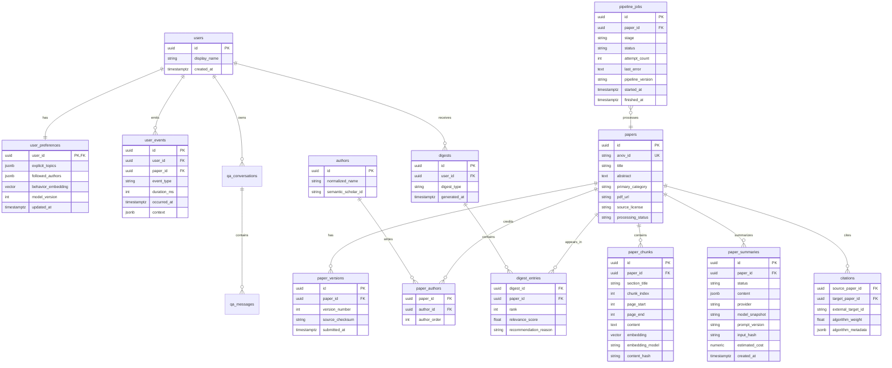

# Data Model v0.1

Ruiyu is the DRI for the ER model, SQLAlchemy models, and Alembic migrations. Yifan reviews
fields used by summarization, embeddings, retrieval, recommendation, and evaluation before
the Milestone 1 schema freeze.

## Fixed Decisions

- `papers` identifies a work; `paper_versions` records arXiv revisions.
- Authors are normalized relational entities, not an unqueryable JSON array.
- Digests are immutable generated snapshots so demos and evaluations are reproducible.
- Every event uses a client-generated UUID; duplicate IDs are ignored.
- Summaries are versioned by input hash, provider/model snapshot, and prompt version.
- Chunks retain section, page range, content hash, and embedding model metadata.
- A citation may initially reference an external paper ID; ingestion can resolve it later.
- Deleting a cached PDF does not delete metadata, chunks, or generated artifacts.

## Deferred Algorithm Decision

The exact behavior weights and decay formula are deliberately not frozen at Day 0. Ruiyu
must publish a versioned baseline before Milestone 3 begins. The initial implementation
will use deterministic event weights plus time-decayed weighted averaging of paper
embeddings; no online training is required for the MVP.
