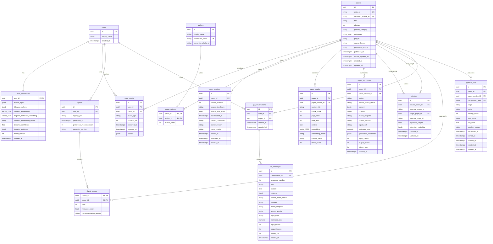

# Data Model v0.1

Ruiyu is the DRI for the ER model, SQLAlchemy models, and Alembic migrations. Yifan reviews
fields used by summarization, embeddings, retrieval, recommendation, and evaluation. Hanyang
reviews fields exposed through Android DTOs. This document is the v0.1 persistence contract, including revision-safe artifacts, durable dispatch, bidirectional citation identities, and the active contrastive behavior profile through migration `0007`; changes require the review process in `CONTRIBUTING.md`.

## Android Local Summary Cache

Android Room schema version 5 adds the nullable `papers.summary_json` column. It stores the
decoded `Summary` API payload, including the ordered claim-to-source association, after the
client has validated that the summary and paper identifiers match. Later paper metadata and
briefing refreshes retain this payload. Migration from schema version 4 leaves the new column
null, so an older cache continues to provide paper metadata without presenting a cached
summary. A valid legacy summary response can still show its key claims, labeled as having no
recorded per-claim source. An invalid or corrupt local summary payload falls back to metadata
and never creates a source action.

## Schema Conventions

- UUID primary keys are generated by the application. Client-generated user-event IDs are
  preserved so duplicate event submissions can be ignored safely.
- All timestamps are timezone-aware UTC values. `papers.published_at` plus `papers.id` is the
  stable descending keyset for the paper-list cursor.
- arXiv work IDs are stored without a trailing version suffix. `(paper_id, version_number)` is
  unique in `paper_versions`.
- `user_events.paper_id`, `user_events.duration_ms`, artifact vectors, source licenses, source checksums, document provenance, citation endpoints, job error/timing fields, and model telemetry may be null when the corresponding information is unavailable.
- JSON objects and arrays use PostgreSQL JSONB unless an ordered scalar array is explicitly part
  of the schema. Paper categories use a PostgreSQL text array and preserve the primary category
  separately.
- Embedding columns use pgvector `vector(1536)` in v0.1. A provider must emit 1536-dimensional
  vectors or apply a configured projection. Changing this dimension requires a schema migration.
- Status and role fields use named, non-native check-constrained enums so migrations remain
  explicit and portable across PostgreSQL test databases.
- Monetary estimates use `numeric(12, 6)` and never binary floating point.

## Required Constraints and Indexes

- `papers.arxiv_id`, `authors.normalized_name`, optional non-null Semantic Scholar IDs, and
  `pipeline_jobs.idempotency_key` are unique.
- `paper_versions` is unique on `(paper_id, version_number)`.
- `paper_authors` has a composite primary key and a unique `(paper_id, author_order)` constraint.
- `paper_chunks` is unique on `(paper_version_id, chunk_index)`. Content hashes are indexed for
  provenance and lookup but are not unique because repeated text can be legitimate.
- `paper_summaries` is unique on
  `(paper_version_id, input_hash, provider, model_snapshot, prompt_version)`.
- A citation has exactly one source identity and one target identity: either a local paper UUID or a Semantic Scholar paper ID for each endpoint. `source_paper_id` and `target_paper_id` are therefore independently nullable, but each must be paired with a non-null local or external identity and at least one endpoint must be local. The two Mermaid relations above represent the optional local source and optional local target roles separately.
- `digest_entries` has a composite primary key and a unique `(digest_id, rank)` constraint.
- Non-negative checks apply to event duration, version number, chunk/page indexes, job attempts,
  digest rank, estimated cost, and relevance scores where applicable.
- Query indexes cover papers by `(published_at, id)` and `(primary_category, published_at)`, jobs by `(status, stage)` and `(status, dispatched_at)`, events by `(user_id, occurred_at)`, external citation identities, and foreign-key lookup columns.

## Fixed Decisions

- `papers` identifies a work; `paper_versions` records arXiv revisions.
- Authors are normalized relational entities, not an unqueryable JSON array. `display_name`
  preserves source capitalization while `normalized_name` supports deterministic M1 deduplication.
- Digests are immutable generated snapshots. They retain the preference-model and generator
  versions so demos and evaluations are reproducible.
- The weekly period is part of the durable digest-job identity; v0.1 does not duplicate `week_start` in the immutable `digests` row.
- Every event uses a client-generated UUID; duplicate IDs are ignored.
- Summaries are tied to an observed paper revision and versioned by input hash,
  provider/model snapshot, and prompt version.
- Assistant Q&A messages retain source-match labels, provider/model/prompt identity, input hash,
  latency, token counts, and estimated cost. User messages leave generation fields null.
- Chunks are tied to an observed paper revision and retain section, page range, content hash,
  token count, and embedding model metadata.
- A citation endpoint may initially reference a Semantic Scholar paper ID. After the corresponding paper enters the local catalog, a later graph-sync invocation that encounters its provider identity resolves matching observations.
- Citation edges are deduplicated independently for internal/internal, internal/external, and
  external/internal identities. External/external and resolved self-edges are rejected.
- Pipeline jobs may have no paper only for collection-level stages such as digest assembly.
- Paper-scoped pipeline jobs bind to an exact paper revision; collection-level stages leave both
  paper identifiers null.
- Download provenance is complete as one unit: source PDF SHA-256, byte size, and download timestamp are either all present or all null. Parse provenance is also complete as one unit: parsed-document checksum, parser version, `structured` / `text_only` / `abstract_only` quality tier, and timestamp are either all present or all null.
- A job dispatch lease is represented by `dispatched_at`. Revision-scoped recovery may reclaim queued jobs whose lease is missing or stale; the durable state remains authoritative over Redis delivery.
- Pipeline jobs expose a stable `error_code`; raw `last_error` is operational data and is never
  returned directly by the public API.
- Deleting a cached PDF does not delete metadata, chunks, or generated artifacts.
- The opaque demo-token hash and demo-user UUID are environment configuration, not database
  credentials or a separate authentication table. An idempotent bootstrap command creates the
  configured demo user and initial preferences.

## Behavior Profiles

ADR 0002 freezes `behavior-v1` as a replayable signed-centroid baseline. ADR 0003 defines the active `behavior-v2` profile: independently normalized positive and negative channels, bounded confidence, and inspectable evidence metadata derived from up to 180 days of raw events. Both channels use latest-revision paper embeddings from one exact embedding-model identity. A profile with either channel must retain that identity; an empty profile stores neither channel nor an embedding-model identifier.

The JSON evidence record contains the behavior model name and version, the complete parameter hash, signal and paper counts, positive and negative support, ignored unexposed skips, and embedding coverage. `model_version` remains the public compatibility field. Existing v1 rows retain version 1 and are never relabeled without replay. The dedicated replay command and event ingestion both acquire the user lock and write the derived profile without modifying explicit topics or followed authors.
